# FAKE RDMA

为了快速学习RDMA协议以及内部核心原理，做此记录。

对应的代码仓库：[fake_rdma](https://github.com/ChenMiaoi/fake_rdma)

## First Week

> Target  
> 1. 完成一个fake-rdma device(uverbs)构建，能够在/dev/infiniband下发现该设备(kernel layer，refer erdma)
> 2. 探究ibv_device(ibv_devinfo)是否与provider直接/间接关联，并能够成功访问我们创建的设备

> libverbs.so与privoder的问题  
> 在新版本的`rdma-core`编译出来的libverbs.so实际上依赖于provider产生的动态库，**疑似编译时会通过cmake中的`CONFIG_DIR(/xxx/libibverbs.d)`配置写入libibverbs.so中，在运行时，libibverbs.so会根据指定的配置路径找到\*.driver文件，从而运行实际的provider库**  
> 后续可以研究libibverbs.so动态库具体是如何链入provider动态库信息的

### erdma study

erdma是阿里内部为自己编写的实际的硬件网卡驱动，最早在2022年7月进入linux6.0内核中。与其他RDMA硬件驱动相比，erdma更容易学习。截止到2024年linux-6.11.8版本，erdma累计在驱动层面5364行代码。

> Target  
> 学习erdma如何创建出/dev/infiniband/uverbs驱动设备

学习一个驱动的最好的方式，应该从驱动的`xxx_init_module`开始学习:

<code-block lang="C++">
static __init int erdma_init_module(void)
{
	int ret;

	ret = erdma_cm_init();
	if (ret)
		return ret;

	ret = pci_register_driver(&erdma_pci_driver);
	if (ret)
		erdma_cm_exit();

	return ret;
}
</code-block>

因此，我们需要着重注意`erdma_cm_init`和`pci_register_driver`这两个初始化函数。第一个函数用于初始化一个工作队列(work queue)，`Workqueue`是 Linux 内核中一种用于异步执行任务的机制，在此处我们不做过多深究。

那么创建`/dev/infiniband/uverbs`设备就一定是通过`erdma_pci_driver`这一回调创建的。

<code-block lang="C++">
static struct pci_driver erdma_pci_driver = {
	.name = DRV_MODULE_NAME,
	.id_table = erdma_pci_tbl,
	.probe = erdma_probe,
	.remove = erdma_remove
};
</code-block>

对于前两个字段，分别是驱动设备的名称，以及需要创建的pci设备的设备ID:

<code-block lang="C++">
#define DRV_MODULE_NAME "erdma"
static const struct pci_device_id erdma_pci_tbl[] = {
	{ PCI_DEVICE(PCI_VENDOR_ID_ALIBABA, 0x107f) },
	{}
};
</code-block>

> Question 1  
> 阿里的ERDMA是具有实际的物理硬件的，因此会对应一个PCI设备，那么我没有真实的物理硬件这样创建能够被正确识别吗？

解决完PCI设备的认证问题后，我们率先来看如何创建PCI设备:

``` mermaid
gantt
    dateFormat s
    axisFormat %S
    section erdma_probe
        erdma probe         : a1, 0, 15s
        erdma probe start   : milestone m1, 0, 0
        erdma probe end     : milestone m2, 15, 15
    section detail
        erdma_probe_dev     : a2, after m1, 8
        erdma_ib_device_add : a3, after a2, 15
```

从上图中可以看出，`erdma_probe`会进行两个操作，`erdma_probe_dev`和`erdma_ib_device_add`。我们首先分析`erdma_probe_dev`。

#### erdma_probe_dev

``` mermaid
gantt
    dateFormat s
    axisFormat %S
    section erdma_probe_dev
        probe dev           : a1, 0, 20s
        probe dev start     : milestone m1, 0, 0
        probe dev end       : milestone m2, 20, 20
    section detail
        enable pci device   : a2, after m1, 3
        alloc rdma device   : a3, after a2, 6
        request bar region  : a4, after a3, 11
        check device ok     : a5, after a4, 14
        init hw dev and source      : a6, after a5, 20
```

在`erdma_probe_dev`函数中，我们大致可以分为五个阶段：

- 启用PCI设备
  - 在这个阶段中，我们会显示调用接口函数启用对应的PCI设备，然后设置该设备为总线主设备允许DMA操作
- 分配RDMA设备
  - 在这个阶段，我们会将启用的这个PCI设备绑定到RDMA设备树上
- 请求并映射BAR Region
  - 分配完设备信息后，我们就应该为PCI设备分配出对应的BAR Region
- 检测PCI设备版本和功能
  - 当一切准备就绪后，我们需要验证该PCI设备是否可用
- 初始化ERDMA设备和资源
  - 分配完PCI设备后，我们就需要将该PCI设备绑定到ERDMA的设备上，进行一系列其他需要的资源的初始化操作

> BAR(Base Address Register) Region  
> BAR是计算机硬件(尤其是PCI(Peripheral Component Interconnect))设备用来映射内存和I/O端口的一个重要概念。每个PCI设备可以有多个BAR区域。  
> 也就是说，当一个PCI设备启动并分配特定的BAR区域后，PCI设备就可以通过BAR指定的被映射的系统内存和I/O端口地址与CPU进行交互。
> <code-block lang="Bash">
> lspci -vv
> 00:15.1 PCI bridge: VMware PCI Express Root Port (rev 01) (prog-if 00 [Normal decode])   
>       Control: I/O+ Mem+ BusMaster+ SpecCycle- MemWINV- VGASnoop- ParErr- Stepping- SERR- FastB2B- DisINTx-  
>       Status: Cap+ 66MHz- UDF- FastB2B- ParErr- DEVSEL=fast TAbort- TAbort- MAbort- SERR- PERR- INTx-  
>       Latency: 0, Cache Line Size: 32 bytes  
>       Interrupt: pin ? routed to IRQ 25  
>       Bus: primary=00, secondary=04, subordinate=04, sec-latency=0  
>       I/O behind bridge: 00008000-00008fff [size=4K]  
>       Memory behind bridge: fd000000-fd0fffff [size=1M]  
>       Prefetchable memory behind bridge: 00000000e7600000-00000000e76fffff [size=1M]  
>       Secondary status: 66MHz- FastB2B- ParErr- DEVSEL=fast >TAbort- TAbort- MAbort- SERR- PERR-  
>       BridgeCtl: Parity- SERR+ NoISA+ VGA- VGA16- MAbort- Reset- FastB2B-  
>       PriDiscTmr- SecDiscTmr- DiscTmrStat- DiscTmrSERREn-  
>       Capabilities: access denied  
>       Kernel driver in use: pcieport  
> </code-block>

